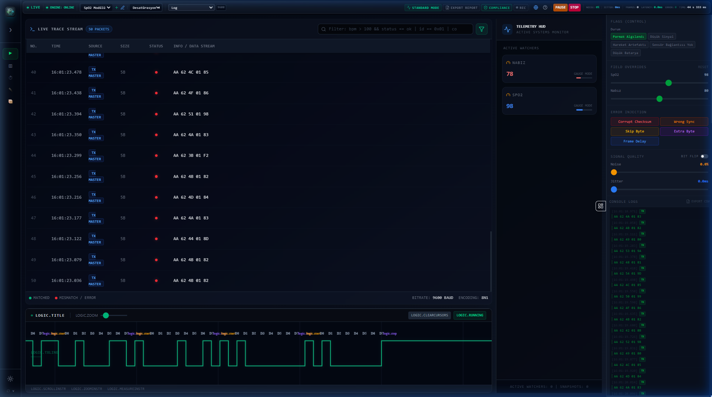
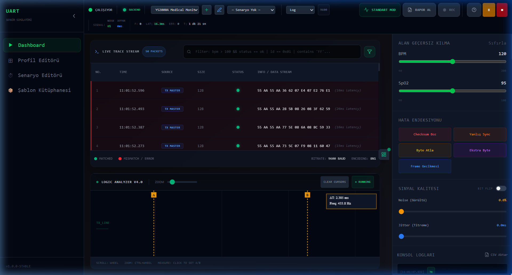
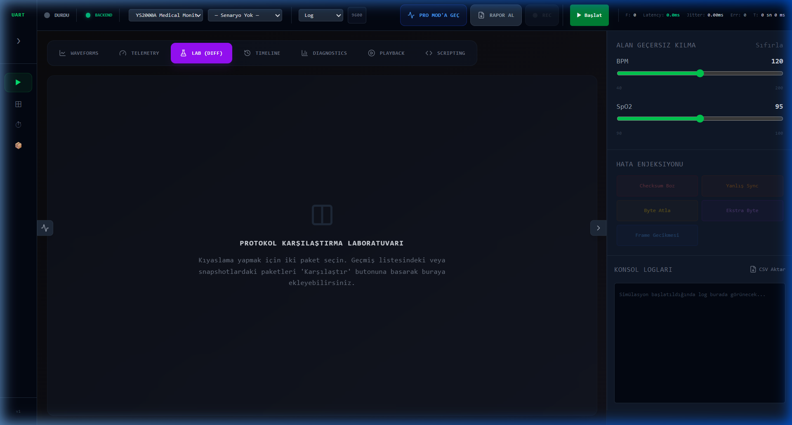

# UART Simulator Pro: Clinical Telemetry & Hardware Engineering Ecosystem

<div align="center">
  
  <br>
  <em>Figure 1: High-Density Medical Dashboard - Real-time SpO2 and Pulse Telemetry.</em>
</div>

<div align="center">


</div>

---

## Executive Summary

The UART Simulator Pro is a professional-grade engineering environment designed for the comprehensive lifecycle of medical device development and protocol validation. By providing a bit-perfect, real-time virtual twin of serial communication layers, the platform enables 100% deterministic testing of SpO2, ECG, and respiratory monitoring systems. It bridges the critical gap between high-level clinical modeling and low-level hardware protocols.

---

## Technical Architecture

The platform is built on an AOT-optimized hybrid architecture, ensuring microsecond-level timing precision and zero-latency data orchestration.

| Component | Implementation | Rationale |
| :--- | :--- | :--- |
| **I/O Core** | Rust (Tauri v2) | Memory-safe, non-blocking serial communication via `serialport` crate. |
| **DSP Engine** | Web Workers | Dedicated threads for high-frequency signal calculation and desaturation models. |
| **State Layer** | Zustand (Atomic) | Minimalist state orchestration for 60Hz real-time telemetry updates. |
| **Viz Engine** | uPlot / Canvas | GPU-accelerated rendering for millions of data points with zero frame drops. |

---

## Comprehensive Module Directory

The ecosystem provides 17+ mission-critical modules for deep protocol inspection and signal integrity analysis.

### Clinical Visualization & Telemetry
- **Dynamic Waveforms:** Real-time rendering of physiological signals (ECG, PPG, Resp).
- **Telemetry HUD:** High-density clinical gauges with configurable threshold alarms.
- **3D Visualizer:** Immersive ICU environment featuring interactive virtual twins for HIL (Hardware-in-the-Loop) verification.

<div align="center">
  
  <br>
  <em>Figure 2: Pro Mode - Bit-level logic analyzer with microsecond-accurate timing.</em>
</div>

### Engineering & Protocol Laboratory
- **Protocol Diff Engine:** Side-by-side binary comparison with real-time bit-mapping.
- **Diagnostics Suite:** Real-time histograms for arrival distribution, jitter analysis, and packet success rates.
- **Signal Integrity Lab:** Controlled injection of white noise, timing jitter, and bit-level corruption for stress testing.
- **Advanced Decoder:** Human-readable protocol breakdown for complex multi-byte medical frames.

<div align="center">
  
  <br>
  <em>Figure 3: Protocol Laboratory - Differential analysis of serial frame packets.</em>
</div>

### Automation & Compliance
- **Scenario Orchestrator:** Scripted clinical events (e.g., desaturation recovery) for automated testing.
- **Sequence Runner:** Automated "Expect/Send" sequences for protocol handshake validation.
- **Compliance Validator:** Automated verification against clinical safety and protocol criteria.
- **Professional Reporting:** Print-ready PDF documentation for regulatory compliance and session history.

<div align="center">
  
  <br>
  <em>Figure 4: Automated Decoder - High-level validation of field-encoded data.</em>
</div>

---

## Performance Benchmarks

The system is engineered for stability under extreme telemetry loads, maintaining a minimalist resource footprint.

| Metric | Target Performance | Benchmarked Stability |
| :--- | :--- | :--- |
| **Internal Latency** | < 1 ms | Deterministic |
| **Packet Throughput** | 10,000+ pkts/sec | Scalable |
| **CPU Utilization** | < 2% @ 115k Baud | Optimized |
| **Memory Footprint** | ~48 MB (Host) | Lightweight |

---

## Hardware Integration & Safety

The platform implements a failsafe hardware management system. Utilizing Rust's ownership model and Mutex-guarded state, the serial handle is strictly isolated, preventing port collisions and ensuring graceful recovery during unexpected process reloads.

```rust
#[tauri::command]
fn write_serial(bytes: Vec<u8>, state: tauri::State<'_, SerialState>) -> Result<(), String> {
    let mut wp = state.write_port.lock().unwrap();
    if let Some(port) = wp.as_mut() {
        port.write_all(&bytes).map_err(|e| e.to_string())
    } else {
        Err("Hardware link not established".to_string())
    }
}
```

---
<div align="center">
Developed by <strong>Mustafa Sercan Sak Diagnostics</strong><br>
© 2026 UART Simulator Pro. Precision Engineering for Medical Excellence.
</div>
