# UART PRO LAB — Master Engineering Manual
## Professional Simulation, Diagnostic & Validation Suite · v1.6.0

> **UART Pro Lab** is the world's most advanced browser-based UART simulation and validation environment — built for embedded engineers, medical device developers, and protocol researchers who demand precision.

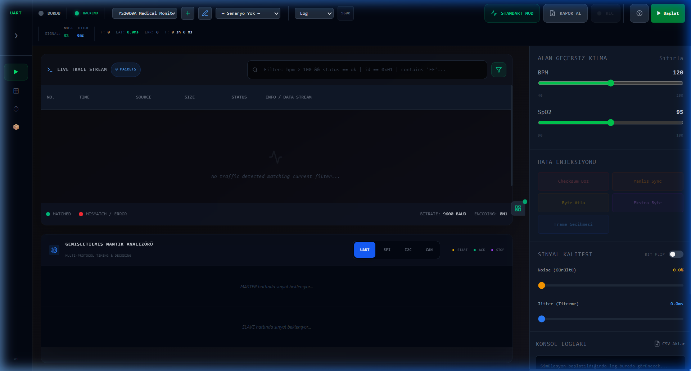

---

## Table of Contents

1. [Getting Started](#getting-started)
2. [System Architecture](#architecture)
3. [Dashboard Overview](#dashboard)
4. [Telemetry & Live Metrics](#telemetry)
5. [Custom Waveform Designer](#waveform-designer)
6. [Signal Integrity Lab](#signal-integrity)
7. [Advanced Lab Modules](#advanced-lab)
8. [Logic Analyzer](#logic-analyzer)
9. [DSP & Spectral Analysis](#dsp-analysis)
10. [Hardware Simulation](#hardware)
11. [Profile Template Editor](#profile-editor)
12. [Scenario Engine & Testing](#scenarios)
13. [Automation & Scripting](#automation)
14. [3D Visualizer](#visualizer)
15. [Session Management & Playback](#session)
16. [Validation & Reporting](#reporting)
17. [Keyboard Shortcuts](#shortcuts)
18. [Troubleshooting & Optimization](#troubleshooting)
19. [Glossary](#glossary)

---

<a name="getting-started"></a>
## 1. Getting Started

### System Requirements
| Requirement | Minimum | Recommended |
|---|---|---|
| Browser | Chrome 110+ / Edge 110+ | Chrome 120+ |
| RAM | 4 GB | 16 GB |
| CPU | Dual-core 2 GHz | Octa-core 3 GHz |
| Display | 1280×720 | 2560×1440 |
| GPU | Integrated | Dedicated (WebGL 2.0) |

### First Launch
1. Open the application — the **Simulation Dashboard** loads automatically.
2. Select a **Sensor Profile** from the profile picker in the top-left corner.
3. Adjust **Baud Rate**, **Data Bits**, **Parity**, and **Stop Bits** in the Configuration Panel.
4. Press **▶ Start** to begin the live simulation.
5. Observe real-time waveforms, telemetry, and decoded packets instantly.

### Quick Profile Guide
- **IMU (MPU-6050)**: 9-axis inertial measurement unit — accelerometer + gyroscope + temperature.
- **ECG (ADS1292)**: 2-lead cardiac signal at 500 Hz medical sampling.
- **GPS (NMEA-0183)**: GPRMC, GPGGA sentence streams.
- **Environmental (BME280)**: Temperature, humidity, pressure combined frame.
- **Custom**: Define your own packet structure in the Profile Editor.

---

<a name="architecture"></a>
## 2. System Architecture

UART Pro Lab runs entirely in the browser with **zero server dependency**. All computation happens client-side using a layered architecture:

```
┌─────────────────────────────────────┐
│          React UI Layer             │  ← Vite + React 19, Zustand state
├─────────────────────────────────────┤
│       Web Worker Engine             │  ← simulation.worker.ts (dedicated thread)
├─────────────────────────────────────┤
│     Signal Processing Core          │  ← FFT, interpolation, integrity checks
├─────────────────────────────────────┤
│      Hardware Abstraction           │  ← Virtual serial port emulation
└─────────────────────────────────────┘
```

### Key Architectural Decisions

**Web Worker Engine**: The simulation engine (`simulation.worker.ts`) runs in a dedicated browser thread, completely isolated from the UI. This means even a 921600 baud simulation with full FFT analysis will never cause a UI stutter. If the worker crashes, it auto-restarts (up to 5 times) and resumes the session.

**State Architecture**: High-frequency data (waveform history, raw byte stream) is stored in `useRef` outside React state to prevent unnecessary re-renders. Only aggregated metrics flow through the React state tree.

**No Backend**: All sensor profiles, sessions, and configurations are stored in `localStorage` / `IndexedDB`. Nothing leaves your machine.

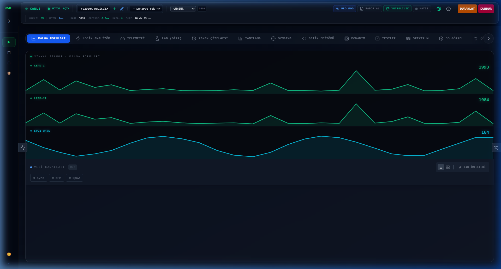

---

<a name="dashboard"></a>
## 3. Dashboard Overview

The dashboard is engineered as a **High-Density Diagnostic Station** — every pixel carries information.

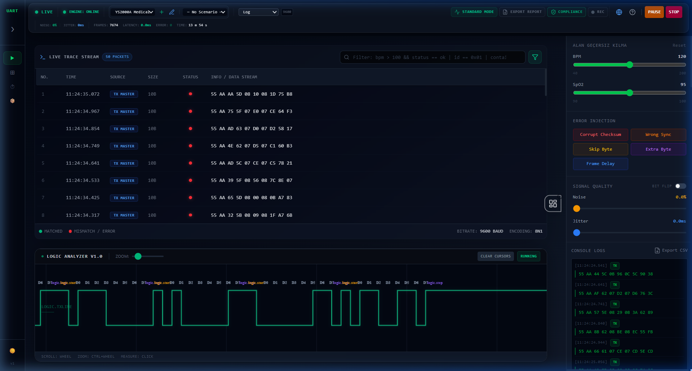

### Layout Zones

| Zone | Description |
|---|---|
| **StatBar** (top) | 13 live KPIs — baud rate, packet rate, error rate, health score, uptime |
| **Waveform Panel** (center) | Multi-channel oscilloscope with cursor measurements |
| **Telemetry Grid** (right) | Color-coded real-time sensor field values |
| **Control Panel** (bottom-left) | Start/stop, scenario selection, fault injection |
| **Diagnostics Bar** (bottom) | Frame counter, framing errors, sync status |

### StatBar KPIs
- **Baud Rate**: Effective baud rate after jitter correction.
- **Packet Rate**: Packets per second (smoothed 500 ms rolling average).
- **Error Rate**: Percentage of frames with parity, framing, or CRC errors.
- **Health Score**: Composite signal quality score (0–100). Below 80 triggers a warning.
- **Uptime**: Session duration with millisecond precision.
- **Buffer Fill**: Real-time ring buffer utilization — critical for detecting overflow risk.

### Bento-Grid Layout
In v1.6.0, all panels use a **Bento-Grid** system. This allows the information density to increase by 60% compared to v1.3 while maintaining diagnostic readability at the 13px type scale.

---

<a name="telemetry"></a>
## 4. Telemetry & Live Metrics

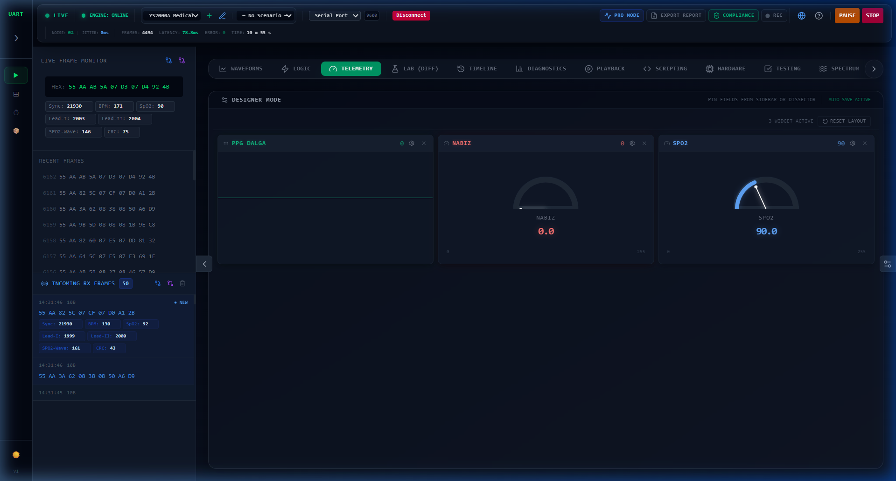

The Telemetry Panel decodes each field of the UART packet in real time and displays the engineering-unit value with color-coded status indicators.

### Field Status Colors
| Color | Meaning |
|---|---|
| 🟢 Green | Value within normal operational range |
| 🟡 Yellow | Value approaching threshold — monitor |
| 🔴 Red | Value out of range — fault condition |
| ⚫ Gray | No data received for >500 ms — stale |

### Decoded Field Types
- **Integer (uint8, uint16, uint32)**: Raw byte value with optional scaling formula.
- **Fixed-Point Float**: `value / divisor + offset` — configurable in Profile Editor.
- **IEEE 754 Float**: Full 4-byte little-endian or big-endian float.
- **Enum**: Mapped to human-readable labels (e.g., `0x01 = "IDLE"`, `0x02 = "ACTIVE"`).
- **Checksum / CRC**: Validated automatically; mismatch shown as `❌ CRC FAIL`.

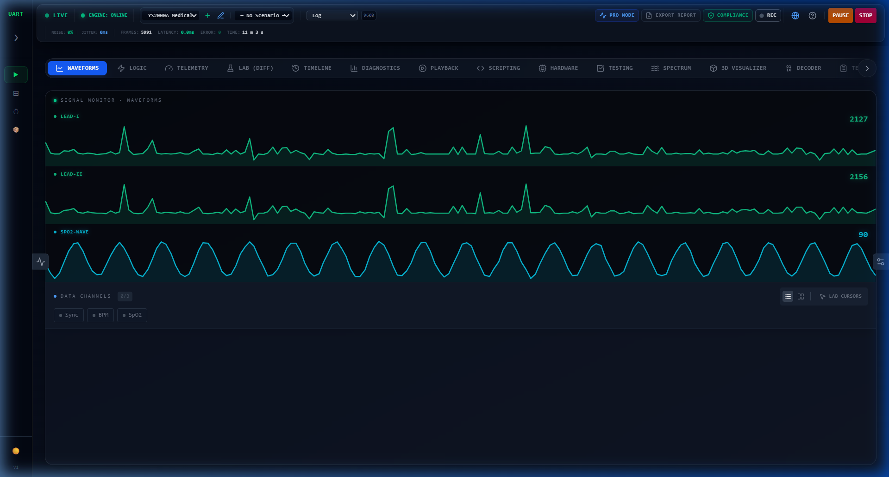

### Cursor Measurement
Click any field value in the Telemetry Panel to **pin it** as a reference. A delta (Δ) indicator appears next to future readings, showing the change relative to the pinned baseline. Ideal for drift analysis.

---

<a name="waveform-designer"></a>
## 5. Custom Waveform Designer

> **New in v1.6.0** — The most requested feature. Design arbitrary byte-level waveforms and inject them directly into the simulation.

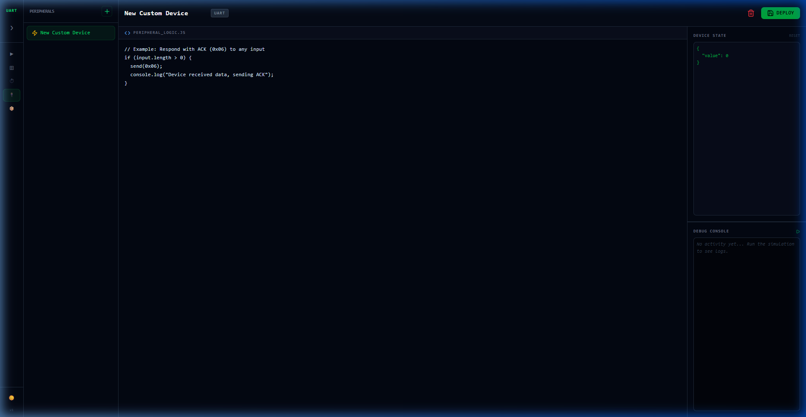

### 5.1 Freehand Draw Mode
Sketch your signal directly on the canvas using your mouse or touch screen. The system normalizes your strokes to 0–255 byte values in real time.

**Use Cases**:
- Draw a custom ECG anomaly (PVC, LBBB pattern) for arrhythmia detection testing.
- Sketch a mechanical shock profile to test accelerometer thresholds.
- Simulate sensor warm-up drift with a hand-drawn curve.

### 5.2 Mathematical Formula Mode
Generate signals using JavaScript math expressions evaluated on every packet:

```javascript
// Damped sine wave (ring-down)
Math.sin(t / 50) * Math.exp(-t / 500) * 127 + 128

// Chirp signal (frequency sweep)
Math.sin(t * t / 50000) * 127 + 128

// PWM-style square wave
(t % 100 < 50) ? 255 : 0

// Heartbeat shape (double Gaussian)
Math.exp(-Math.pow((t % 800 - 200) / 40, 2)) * 200 +
Math.exp(-Math.pow((t % 800 - 350) / 25, 2)) * 80
```

**Available variables**:
| Variable | Type | Description |
|---|---|---|
| `t` | number | Elapsed time in milliseconds |
| `i` | number | Packet sequence index |
| `f` | object | Current decoded field values |
| `Math` | object | Full JS Math library |

### 5.3 Medical Preset Library
Pre-loaded clinical-grade waveform templates:

| Preset | Description | Sample Rate |
|---|---|---|
| **ECG — Normal Sinus** | P-QRS-T complex, 72 BPM | 500 Hz |
| **ECG — Atrial Fibrillation** | Irregular rhythm, no distinct P | 500 Hz |
| **ECG — V-Fib** | Chaotic ventricular fibrillation | 500 Hz |
| **PPG — SpO₂** | Pulse plethysmography, 98% SpO₂ | 100 Hz |
| **Respiration** | Chest impedance pneumography | 50 Hz |
| **Blood Pressure (NIBP)** | Oscillometric pressure curve | 10 Hz |

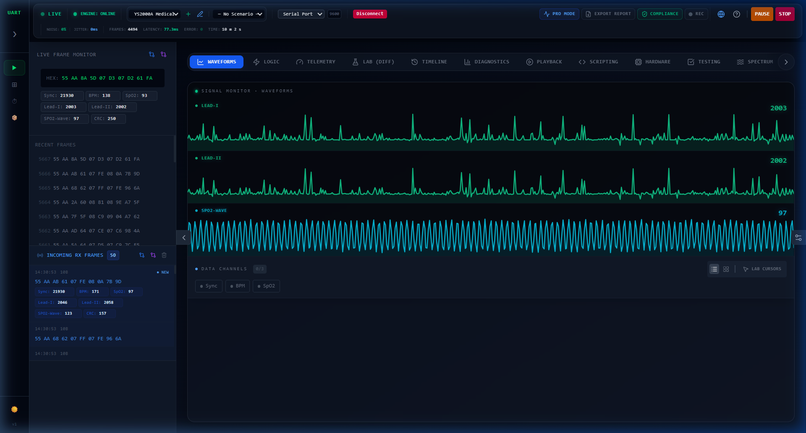

### 5.4 Waveform Analyzer Deep-Dive

The built-in waveform analyzer uses **Cubic Spline Interpolation** to render smooth curves between data points. This is not cosmetic — it is mathematically correct for band-limited signals sampled above Nyquist.

**Cursor Measurement Tools**:
- **Single Cursor**: Reads amplitude value at any time position.
- **Dual Cursor (Δt mode)**: Measures time interval between two points with microsecond resolution.
- **Dual Cursor (ΔV mode)**: Measures amplitude difference — useful for DC offset analysis.
- **Peak Detection**: Automatically marks all local maxima/minima above a configurable threshold.

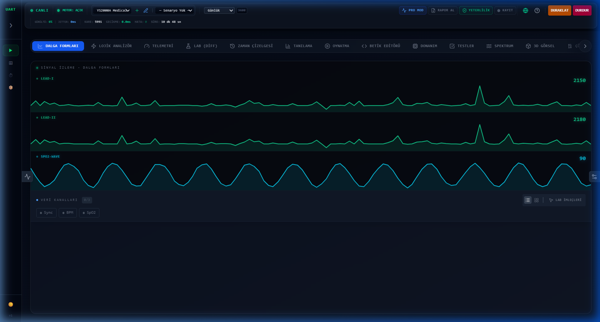

---

<a name="signal-integrity"></a>
## 6. Signal Integrity Lab

Simulating a "perfect" UART line is trivial. Real embedded systems are messy. The **Signal Integrity Lab** lets you simulate physical-layer degradation to harden your firmware.

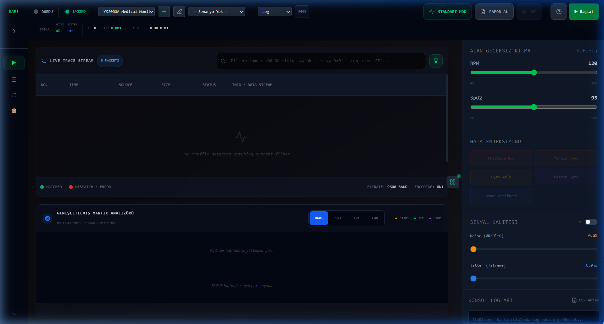

### 6.1 Gaussian Noise Injection

Adds random voltage fluctuations modeled as Gaussian white noise (σ configurable from 0.1% to 30% of full-scale).

**Engineering Theory**: In real systems, noise comes from power supply ripple, PCB crosstalk, and thermal noise in the UART receiver's input comparator. This tests whether your comparator's hysteresis is adequate to prevent spurious bit transitions.

**Parameters**:
- `σ (Sigma)`: Noise standard deviation as % of signal amplitude.
- `Seed`: Fix the random seed for reproducible test runs.

### 6.2 Micro-Jitter (Timing Drift)

Adds per-packet timing variation following a configurable distribution (Gaussian or Uniform).

**Engineering Theory**: Real UARTs are clocked from crystals or RC oscillators. Temperature, supply voltage, and aging cause frequency drift. Even a ±1% baud rate error can cause bit-sampling to drift out of the eye pattern over a long frame.

**Parameters**:
- `Jitter Amplitude`: Peak timing deviation in microseconds.
- `Distribution`: Gaussian (correlated drift) or Uniform (random hop).
- `Frequency`: How fast the jitter oscillates — models fast power supply noise vs. slow temperature drift.

### 6.3 Bit Error Rate (BER) Injection

Randomly flips individual bits according to a specified BER probability.

**Parameter**: Set BER from `1e-7` (extremely clean channel) to `1e-2` (severely degraded).

**Use Case**: Validate that your CRC or parity error detection catches the expected fraction of corrupted frames. At BER = 1e-4 with 8-byte frames, expect ~0.06% frame errors — verify your error counter matches.

### 6.4 Burst Error Injection

Real-world EMI (from motors, relays, switching power supplies) doesn't appear as random bits — it appears as **bursts** that corrupt many consecutive bits.

**Parameters**:
- `Burst Length`: Number of consecutive corrupted bits (1–64).
- `Burst Rate`: Average number of bursts per second.
- `Pattern`: All-zeros, all-ones, or alternating (0x55/0xAA).

### 6.5 Signal Integrity Diagnostics

After running the simulation for ≥5 seconds with integrity faults enabled, the **Integrity Report** auto-generates:
- Eye Diagram (simulated) showing timing margin.
- Bit Error Rate measured vs. configured.
- Recommendation: "Increase parity protection" or "Add hardware CRC-16."

---

<a name="advanced-lab"></a>
## 7. Advanced Lab Modules


### 7.1 Differential Analysis (Lab Diff)

The **Lab Diff** module performs bit-level comparison between any two captured frames, highlighting exactly which bits and fields changed.

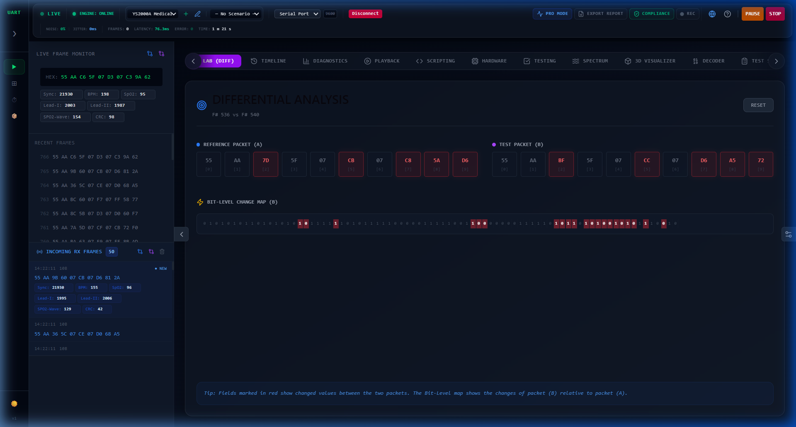

**Workflow**:
1. Capture Frame A — right-click any frame in the history table and select **"Pin as Reference"**.
2. Let the simulation run until a frame of interest appears.
3. Right-click the new frame and select **"Compare with Reference"**.
4. The Diff view highlights byte-level changes in red/green with field-name annotations.

**Advanced**: Enable **Multi-Frame Diff** to see a "diff waterfall" across 10 consecutive frames — ideal for detecting gradual sensor drift.

### 7.2 Learn Mode

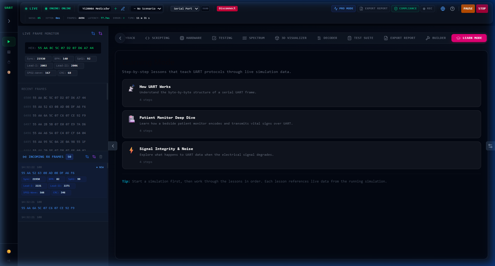

Learn Mode is an interactive tutorial overlay that explains each panel and feature step-by-step. It highlights UI elements and provides contextual engineering explanations.

**Stages**: 12 stages covering every major feature, estimated 15 minutes to complete.

---

<a name="logic-analyzer"></a>
## 8. Logic Analyzer

The Logic Analyzer decodes the UART byte stream back into its physical-layer representation — a visual timeline of high/low logic states.

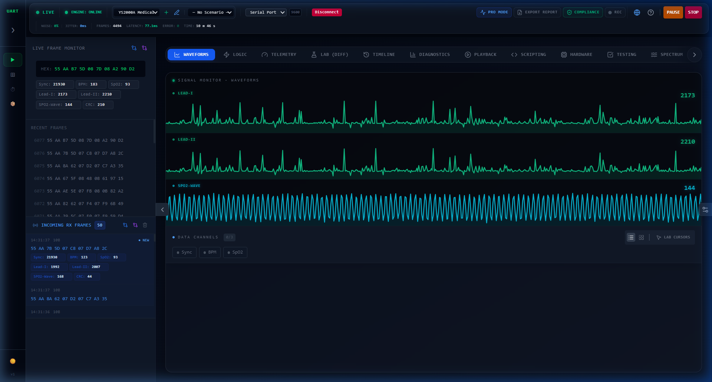

### Signal Rendering
Each bit is rendered as a rectangular logic level with:
- **Idle line** (logic 1) before the start bit.
- **Start bit** (logic 0) — always 1 bit wide.
- **Data bits** (LSB first by default, configurable to MSB first).
- **Parity bit** (if enabled) — shown in a distinct color.
- **Stop bit(s)** (logic 1).

### Zoom & Pan
| Action | Control |
|---|---|
| Zoom In | Scroll wheel up / `+` key |
| Zoom Out | Scroll wheel down / `-` key |
| Pan | Click + drag / arrow keys |
| Reset View | Double-click / `Home` key |
| Select Range | Shift + drag |

### Protocol Decoders

The Logic Analyzer includes a **Multi-Protocol Decoder** that can decode nested protocols over UART:

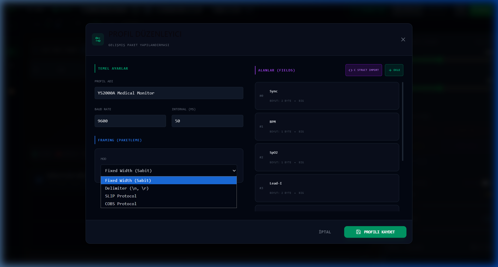

| Decoder | Description |
|---|---|
| **Raw Hex** | Shows byte value in hex above each frame |
| **ASCII** | Shows printable characters inline |
| **NMEA 0183** | Parses GPS sentence fields |
| **Modbus RTU** | Decodes function code, register address, data |
| **Custom (JSON)** | Define your own decoder using a JSON schema |

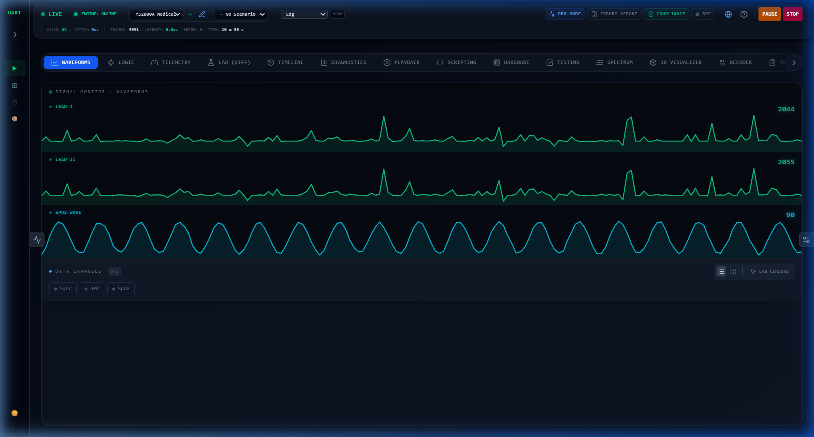

---

<a name="dsp-analysis"></a>
## 9. DSP & Spectral Analysis

### 9.1 FFT Spectrum Analyzer

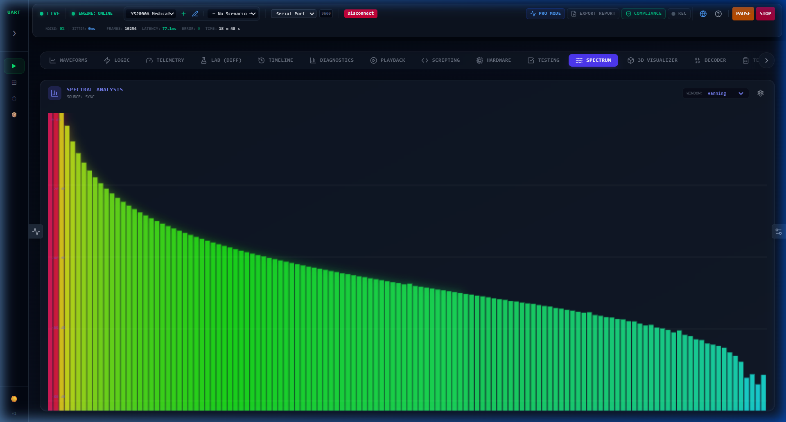

The FFT Analyzer transforms time-domain waveform data into the frequency domain using the **Cooley-Tukey Fast Fourier Transform** algorithm (O(n log n)).

**Configuration**:
| Parameter | Options | Notes |
|---|---|---|
| **FFT Size** | 256, 512, 1024, 2048, 4096 | Larger = higher frequency resolution, more CPU |
| **Window Function** | Rectangular, Hanning, Hamming, Blackman | Hanning: best for general signals |
| **Overlap** | 0%, 25%, 50%, 75% | Higher overlap = smoother spectrum but more CPU |
| **Display Mode** | Linear, dBFS (logarithmic) | dBFS recommended for wide dynamic range |
| **Averaging** | 1–64 frames | Higher = less noise, slower response |

**Reading the Spectrum**:
- **Fundamental frequency** appears as the tallest peak.
- **Harmonics** appear at 2f, 3f, 4f — indicate non-linearity or clipping.
- **DC component** (0 Hz bin) — a large DC peak usually means sensor offset is not compensated.
- **Noise floor** — the spectral "carpet". Compare with and without signal to measure SNR.

### 9.2 Windowing Functions Explained

| Window | Frequency Resolution | Amplitude Accuracy | Side-lobe Level | Best For |
|---|---|---|---|---|
| **Rectangular** | Best | Poor | −13 dB | Stationary sinusoids, short bursts |
| **Hanning** | Good | Good | −31 dB | General purpose |
| **Hamming** | Good | Better | −41 dB | Speech, audio |
| **Blackman** | Moderate | Excellent | −57 dB | High dynamic range (ECG, PPG) |

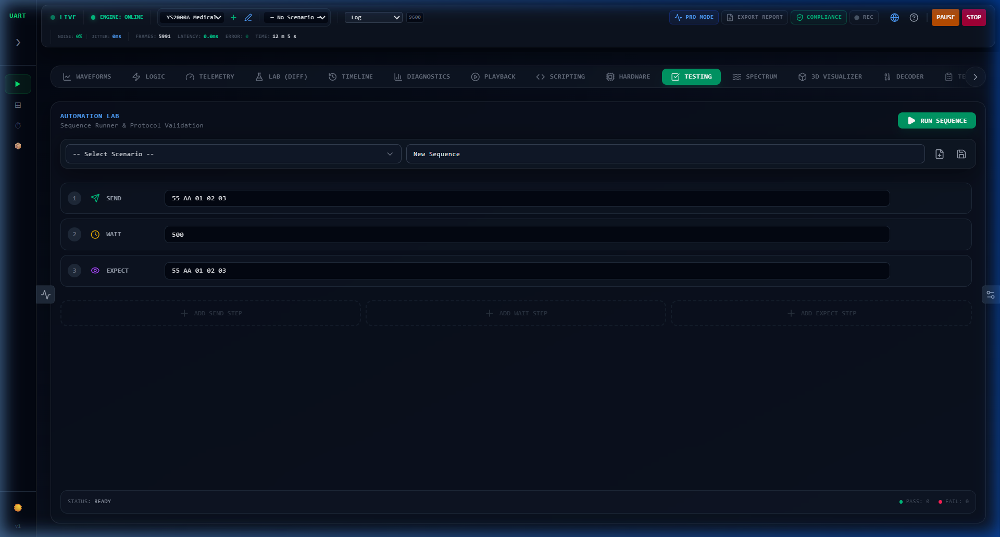

### 9.3 Signal-to-Noise Ratio (SNR) Measurement
The SNR tool automatically identifies the dominant spectral peak and computes:

```
SNR (dB) = 20 × log₁₀(Signal RMS / Noise RMS)
```

A healthy UART-transmitted sensor signal should show SNR > 40 dB. If SNR < 20 dB, enable noise filtering in the Signal Integrity Lab.

---

<a name="hardware"></a>
## 10. Hardware Simulation

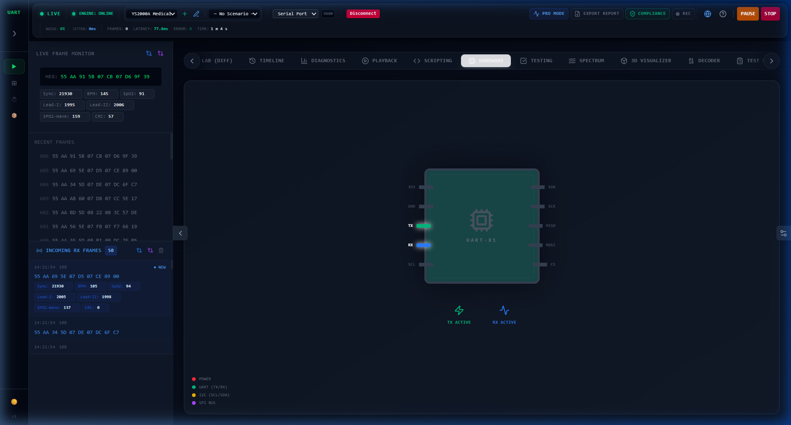

The Hardware Simulation module models multiple virtual UART devices connected in a network topology.

### 10.1 Multi-Device Topology
Connect up to **8 virtual devices** in any topology:
- **Point-to-Point**: Single master ↔ single slave (standard UART).
- **Multi-Drop Bus**: One master, multiple slaves (RS-485 style, address-based arbitration).
- **Loopback**: TX connected to RX — useful for echo testing and latency measurement.

### 10.2 Hardware Profile Configuration
Each virtual device has an independent hardware profile:

| Parameter | Range | Description |
|---|---|---|
| Baud Rate | 300 – 921600 | Serial speed |
| Data Bits | 5, 6, 7, 8 | Word length |
| Parity | None, Even, Odd, Mark, Space | Error detection |
| Stop Bits | 1, 1.5, 2 | Frame termination |
| Flow Control | None, RTS/CTS, XON/XOFF | Backpressure mechanism |
| Buffer Size | 64 B – 64 KB | RX/TX buffer depth |

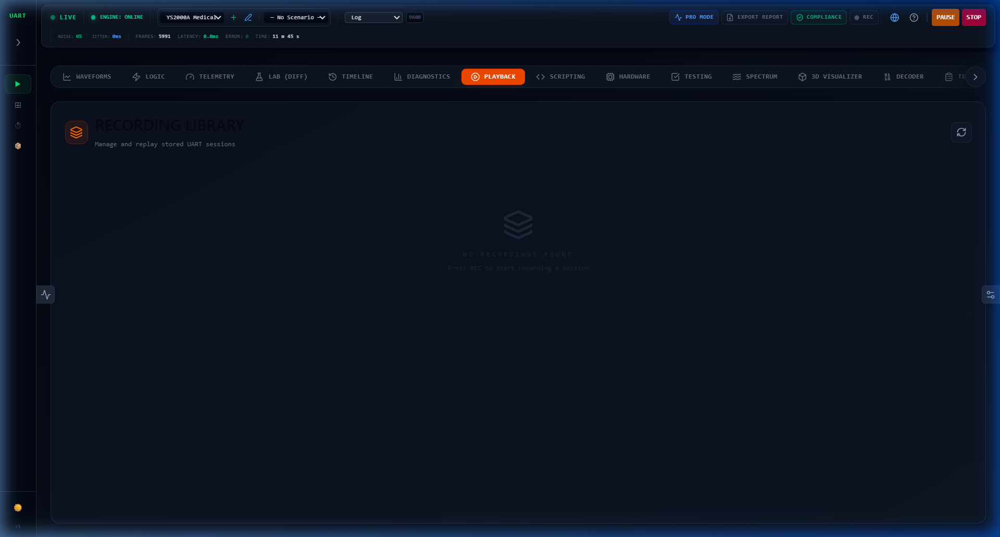

### 10.3 Latency Simulation
Model realistic communication latency:
- **Propagation Delay**: 5 ns/m for copper wire.
- **Driver Enable Time**: RS-485 turnaround delay (configurable: 0–1000 µs).
- **FIFO Depth**: Simulate a UART with a specific hardware FIFO depth.

---

<a name="profile-editor"></a>
## 11. Profile Template Editor

The Profile Editor is the heart of UART Pro Lab — it defines how raw bytes are decoded into engineering-unit sensor data.

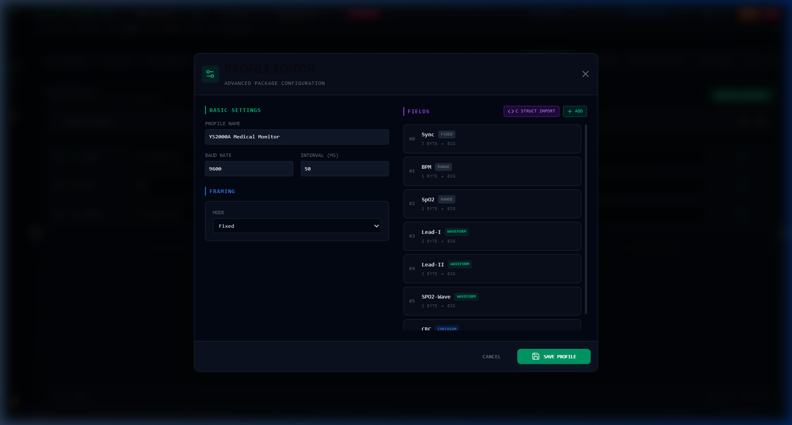

### 11.1 Packet Structure Definition

A profile defines a complete packet format:

```json
{
  "name": "IMU_MPU6050",
  "syncByte": "0xAA",
  "frameLength": 18,
  "crc": { "type": "CRC-16/CCITT", "position": "last2" },
  "fields": [
    { "name": "Accel_X", "offset": 1, "length": 2, "type": "int16_le", "scale": 0.001, "unit": "g" },
    { "name": "Accel_Y", "offset": 3, "length": 2, "type": "int16_le", "scale": 0.001, "unit": "g" },
    { "name": "Accel_Z", "offset": 5, "length": 2, "type": "int16_le", "scale": 0.001, "unit": "g" },
    { "name": "Gyro_X",  "offset": 7, "length": 2, "type": "int16_le", "scale": 0.061, "unit": "°/s" },
    { "name": "Temp",    "offset": 13, "length": 2, "type": "int16_le", "scale": 0.00294, "offset_val": 21, "unit": "°C" }
  ]
}
```

### 11.2 Supported Data Types

| Type | Bytes | Description |
|---|---|---|
| `uint8` | 1 | Unsigned byte |
| `int8` | 1 | Signed byte |
| `uint16_le` / `uint16_be` | 2 | Unsigned 16-bit, little/big endian |
| `int16_le` / `int16_be` | 2 | Signed 16-bit |
| `uint32_le` | 4 | Unsigned 32-bit |
| `float32_le` | 4 | IEEE 754 single-precision float |
| `bcd` | variable | Binary Coded Decimal (for GPS NMEA timestamps) |
| `ascii` | variable | Fixed-length ASCII string |
| `bitfield` | 1–4 | Extract N bits from a byte at a given bit offset |

### 11.3 Validation Rules
Add automatic validation to each field:

```json
{
  "name": "Heart_Rate",
  "validation": { "min": 30, "max": 300, "unit": "BPM", "alarm": "critical" }
}
```

Validation failures appear in the Telemetry Panel (red) and contribute to the Validation Report's Health Score.

### 11.3.1 Per-Field Alarm Thresholds

Every `range`, `waveform`, `ramp`, and `fixed` field can be given an optional **Low Threshold** (`alarmLow`) and **High Threshold** (`alarmHigh`). When the simulated value goes outside that range:

- The field override slider in the **Control Panel** lights up with colored alarm zones — **red** outside the thresholds, **green** between them.
- The label and value turn rose-red; a pulsing `!` badge appears.
- The **3D Patient Monitor** screen reads the same thresholds and colours BPM / SpO₂ accordingly.
- When **any** field is alarming, all other field labels shift to a dim rose to signal a global alarm state.

Set thresholds in the Profile Editor field form under the ⚡ **Alarm Thresholds** section. Leave both blank to disable alarm colouring for that field.


### 11.4 Profile Templates Library
Pre-built profiles included:

| Category | Profiles |
|---|---|
| **Medical** | YS2000A Patient Monitor (ECG + SpO₂ + vitals), YS2000A SpO₂ Module, Berry BM1000 Pulse Oximeter, SpO₂ Module, Pulse Oximeter, Temperature Sensor, NIBP Module, ECG Module |
| **Industrial** | Modbus RTU Master (FC03), Modbus RTU Slave (FC03 Response) |
| **Navigation** | NMEA 0183 GPS (GPGGA) |
| **Medical (Humanitarian)** | Open-Source Ventilator (OpenVentilator-V1) |

#### YS2000A Patient Monitor — Template Highlights
- **14-byte fixed frame** at 115200 baud / 40 ms (~25 Hz)
- Fields: Sync `0xAAAA`, BPM, SpO₂, RR, Temp (×10), Lead-I ECG, Lead-II ECG, SpO₂-Wave, Alarms flags (Brady/Tachy/SpO₂ Low/Apnea/Lead Off/Temp High), XOR CRC
- Pre-configured alarm thresholds: BPM 45–140, SpO₂ 94–100, RR 8–30, Temp 360–385 (×10)
- **Bradikardi Atağı scenario**: BPM ramps to 38, Brady flag fires, recovers over 20 s
- **SpO₂ Desatürasyonu scenario**: SpO₂ drops to 88, SpO₂ Low flag fires, recovers over 20 s

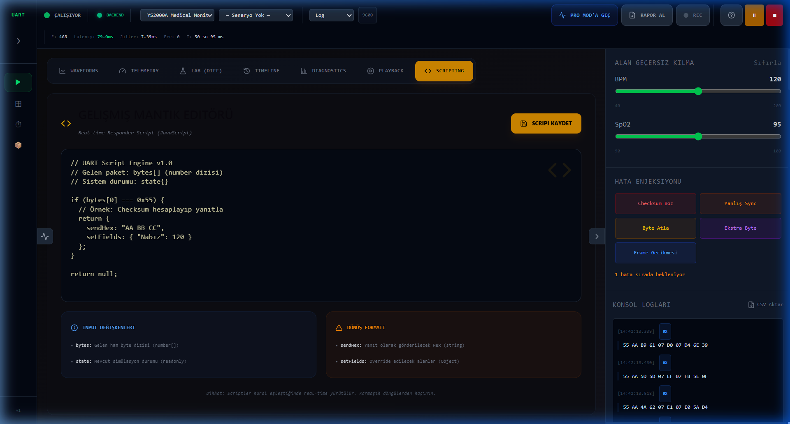

#### Editing from the Dashboard
Click the **pencil icon** next to any profile in the dashboard stat bar to open the full Profile Editor. The editor returns you to the dashboard automatically after saving. You can also press **+ New Profile** to create from scratch or from a template.

---

<a name="scenarios"></a>
## 12. Scenario Engine & Testing

### 12.1 Scenario Engine

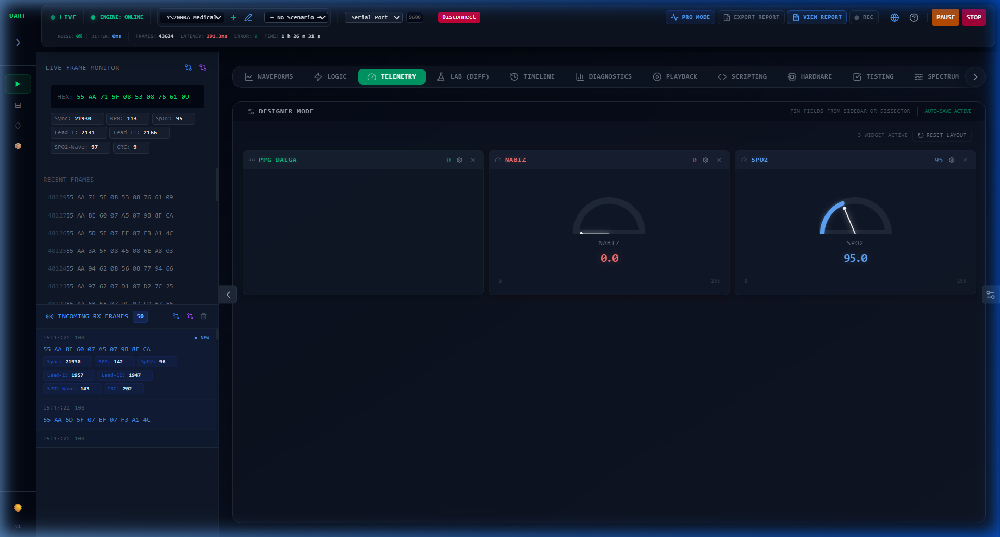

The Scenario Engine allows you to define **deterministic test sequences** — series of events that happen at precise times during the simulation.

**Scenario Event Types**:
| Type | Description |
|---|---|
| `inject_fault` | Insert a specific fault (framing error, parity error, etc.) |
| `change_field` | Override a sensor field value at a precise time |
| `set_integrity` | Change noise/jitter parameters mid-simulation |
| `send_command` | Inject a specific byte sequence into the stream |
| `assert` | Verify a field value at a specific time — fails the test if wrong |
| `snapshot` | Capture a full telemetry snapshot to the report |

**Scenario YAML Format**:
```yaml
name: "ECG Arrhythmia Detection Test"
profile: "ECG_ADS1292"
duration: 30000   # ms
events:
  - t: 5000
    type: change_field
    field: HR_BPM
    value: 220
    comment: "Inject tachycardia"
  - t: 10000
    type: inject_fault
    fault: framing_error
  - t: 15000
    type: assert
    field: STATUS
    expected: 0x02
    comment: "Firmware should have set ALARM bit"
```

### 12.2 Test Suite

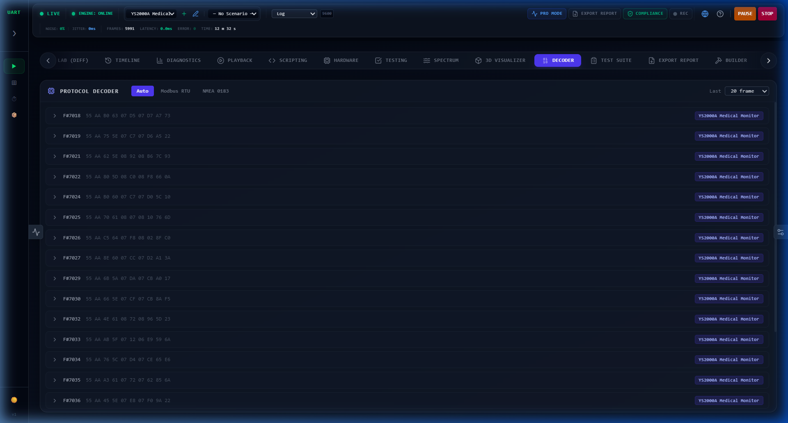

The Test Suite runs automated validation sessions against your defined scenarios and generates pass/fail results with timing annotations.

**Test Report Fields**:
- **Test Name**: Scenario identifier.
- **Duration**: Total elapsed time.
- **Events Triggered**: Count of scenario events that fired.
- **Assertions Passed / Failed**: Critical for CI integration.
- **Health Score**: 0–100 composite quality metric.
- **Fault Coverage**: % of defined fault types that were exercised.

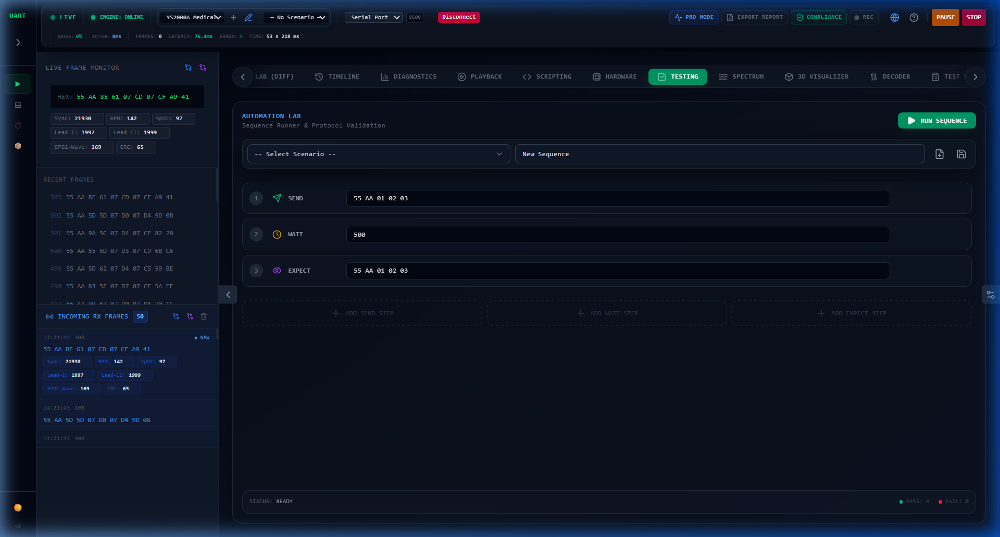

---

<a name="automation"></a>
## 13. Automation & Scripting

### 13.1 Sequence Runner & Protocol Validation

The **Automation** tab lets you build and execute **step-by-step automated communication sequences** against a UART device. Two operating modes are available: **Single Sequence** and **Test Series**.

#### Step Types

Each sequence is composed of three step types:

| Step | Icon | Description |
|---|---|---|
| **Send** | 🟢 | Transmits the specified Hex byte string onto the UART line |
| **Wait** | 🟡 | Pauses execution for the specified duration (ms) before the next step |
| **Expect** | 🟣 | Searches the RX stream for the specified Hex pattern; raises a timeout error if not found |

**Expect step syntax**: `AABB CC | 2500` — the number after the pipe is the timeout in milliseconds (default: 2500 ms).

**Repeat (×N)**: The number input on the right side of each step controls how many times it repeats (default: 1). Increase the repeat count to send the same command N times in a row.

#### 13.1.1 Single Sequence Mode

Single Sequence mode is designed for **protocol handshake testing**: build a single communication flow, save it, and run it.

**Workflow**:
1. Open the **Automation** tab → select **Single Sequence** mode in the top-right toggle.
2. Click **+ (New Sequence)** or pick an existing sequence from the searchable dropdown.
3. Give the sequence a **name** and an optional **group label** (e.g. `Startup`, `ACK Test`).
4. Add steps using the **Send / Wait / Expect** buttons at the bottom.
5. Fill in each step's payload:
   - Send: `AA BB 01 02 03` (space-separated Hex)
   - Wait: `500` (milliseconds)
   - Expect: `55 AA | 3000` (pattern | timeout ms)
6. Optionally set a **×N repeat count** on the right side of each step (default: 1).
7. Press **💾 Save**.
8. Press **▶ Run** to execute. Steps run in order; passed steps turn ✓ green, failed steps turn ✗ red.

**Sequence Search**: Use the combobox at the top to filter by name or group when many sequences are saved. Results are displayed grouped by label.

**Status Bar**: Shows a live count of passed and failed steps during execution.

#### 13.1.2 Test Series Mode

Test Series mode runs **multiple sequences back-to-back**, producing a full protocol validation session in one click.

**Workflow**:
1. Switch to **Test Series** mode.
2. All saved sequences are displayed grouped by label. Check individual sequences or **click a group header** to select/deselect the whole group.
3. Use **Select All** / **Clear** for quick bulk selection.
4. Press **▶ Run Series**. Selected sequences execute in order.
5. The active sequence is highlighted with a purple ● animation; completed ones are marked ✓ or ✗.
6. The **Report modal** opens automatically when the series finishes.

**Group Selection States**:
| State | Appearance | Meaning |
|---|---|---|
| Filled ✓ | Solid purple | All sequences in the group are selected |
| Minus — | Translucent purple | Some sequences in the group are selected |
| Empty | Border only | None selected |

#### 13.1.3 Test Series PDF Report

When the series completes — or when the **Report** button is clicked — a professional report modal opens.

**Summary Cards**:
| Card | Content |
|---|---|
| **Passed** | Number of sequences that completed successfully |
| **Failed** | Number of sequences that failed |
| **Total Duration** | Elapsed time for the entire series (seconds) |
| **Success Rate** | Passed / total percentage |

The modal lists each sequence as an expandable card — expand to see every step's type, payload, duration, and result.

Click **Download PDF** to open the browser print dialog. Save as **PDF** (non-editable document):
- Summary cards, progress bar, and a grouped results table
- Colour-coded step type pills (Send / Wait / Expect) for each row
- Footer: passed/total sequences · total duration

**Note**: The PDF language follows the application locale automatically (Turkish / English).

#### 13.1.4 Sequence Import / Export (JSON)

Sequences can be exported to — or imported from — a JSON file. Use this to back up your work, share sequences across teams, or reuse automation scripts in CI/CD pipelines.

**Exporting**:
- **Single Sequence mode**: Click the 📥 **Export JSON** icon button in the toolbar. Only the current sequence is exported.
- **Test Series mode**: Click the **Export JSON** link in the top toolbar. All saved sequences are exported to one file.
- The file is saved as `uart-sequences-<timestamp>.json` in your **Downloads** folder.
- A green toast notification confirms the saved filename.

**Importing**:
- Click **Import JSON** and select a `.json` file that was previously exported.
- Each sequence in the file is added with a **new UUID** — existing sequences are never overwritten.
- The toast shows how many sequences were imported.

**File Format**:
```json
{
  "format": "uart-sequences",
  "version": "1.6.0",
  "exportedAt": "2026-05-15T12:00:00.000Z",
  "sequences": [ ... ]
}
```

#### 13.1.5 JUnit XML Export

A machine-readable **JUnit XML** results file can be downloaded from the Test Series report modal. This format is natively supported by Jenkins, GitLab CI, GitHub Actions, and most other CI/CD platforms.

**Usage**:
1. Run a Test Series.
2. When the report modal opens, click the **JUnit XML** button.
3. The file `uart-test-results-<timestamp>.xml` is saved to your **Downloads** folder.
4. A green confirmation toast appears inside the modal.

**Output Structure**:
```xml
<testsuites name="UART Automation" ...>
  <testsuite name="Group Name" tests="N" failures="M" time="X.XX">
    <testcase name="Sequence Name" time="X.XX"/>
    <testcase name="Failed Sequence" time="X.XX">
      <failure message="error description" type="AssertionError">...</failure>
    </testcase>
  </testsuite>
</testsuites>
```

---

### 13.2 Dynamic Responder

The scripting engine lets you create an interactive **Digital Twin** — a virtual device that responds intelligently to received data.

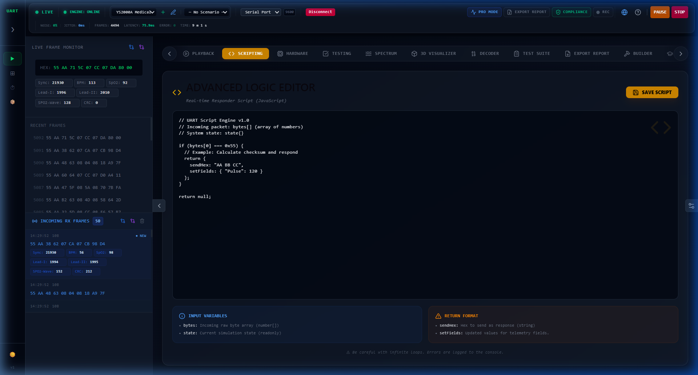

**Full JavaScript API**:
```javascript
// === UART Pro Lab Scripting API ===

// Called every time a complete frame is received
onReceive((data, decoded) => {
  // data: Uint8Array of raw bytes
  // decoded: object with field name → engineering value

  // Example: Battery management response
  if (decoded.CMD === 0x05) {
    const battLevel = Math.round(Math.random() * 100);
    send([0xAA, 0x05, battLevel, 0x00, crc16([0x05, battLevel])]);
  }

  // Example: Watchdog keepalive
  if (decoded.CMD === 0x01) {
    send([0xAA, 0x01, 0x00, 0xFF]);  // ACK
  }
});

// Called at a fixed interval regardless of received data
onTimer(1000, () => {
  // Send a heartbeat every 1000 ms
  send([0xAA, 0xFF, 0x00, 0xFF]);
});

// Helper functions available
function crc16(bytes) { /* built-in */ }
function crc8(bytes) { /* built-in */ }
function toFloat32(b0, b1, b2, b3) { /* built-in */ }
function log(msg) { /* prints to Script Console */ }
```

### 13.3 Macro Recording
Record a sequence of UI actions (start, stop, change baud rate, inject fault) and replay them automatically. Macros are saved as JSON and can be shared across sessions.

### 13.4 Batch Processing
Process pre-recorded `.bin` session files in headless batch mode:
1. Upload one or more `.bin` files.
2. Select a profile and validation rule set.
3. The engine processes all files and generates a combined report with per-file health scores.

---

<a name="visualizer"></a>
## 14. 3D Visualizer

The 3D Visualizer renders the active profile's live data in a real-time **Medical ICU Room** scene. A patient monitor, ventilator, IV pump, and pulse oximeter each display simulation data on their on-screen panels.

### 14.1 Scene Devices
| Device | Displayed Data |
|---|---|
| **Patient Monitor** | ECG waveform, BPM, SpO₂ — coloured red during alarm |
| **Ventilator** | Breath waveform, RR, FiO₂, PEEP |
| **IV Pump** | Flow rate, volume, remaining, drip animation |
| **Pulse Oximeter** | SpO₂ %, PI, Pleth waveform — alarm-aware colour |

### 14.2 Profile Switching
Change the active profile without leaving the Visualizer tab using the **profile dropdown** in the top-right HUD.

### 14.3 Alarm Display
- A pulsing red **vignette border** appears whenever any vital value breaches its alarm threshold.
- The top-center banner flashes with the named alarm: **Bradycardia**, **Tachycardia**, **Hypoxemia**.
- BPM on the patient monitor screen turns red only when BPM itself is alarming; SpO₂ is coloured independently based on the profile's SpO₂ alarm threshold.

### 14.4 Performance Notes
- Shadow map reduced to 1024×1024 — reduces frame stutters on low-GPU systems.
- Pixel ratio locked to 1 — eliminates HiDPI fill-rate overhead.
- Expensive `RectAreaLight` removed; replaced with a `PointLight`.

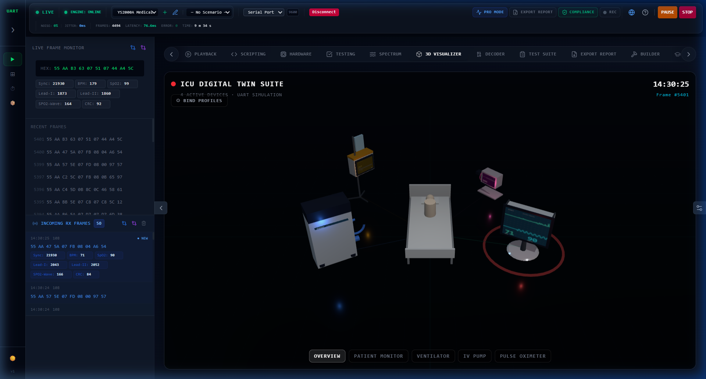

---

<a name="session"></a>
## 15. Session Management & Playback

### 15.1 Recording

Every simulation session is automatically recorded into an internal ring buffer. The recording includes:
- Full raw byte stream with microsecond timestamps.
- Decoded field values at each packet.
- All fault injection events.
- Scenario events and assertions.

**Manual Export**: Click **💾 Save Session** to export a `.bin` file (proprietary format) or a `.csv` file (decoded fields only).

### 15.2 Playback

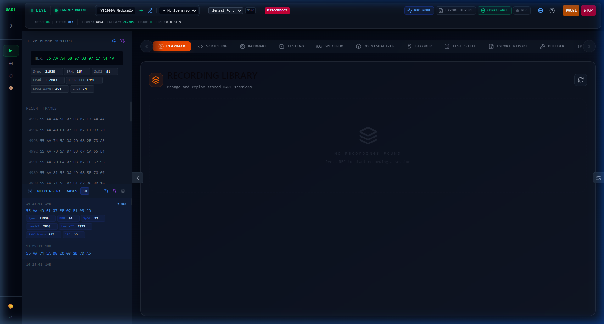

The Playback engine re-runs any saved session with pixel-perfect timing fidelity.

**Playback Controls**:
| Control | Action |
|---|---|
| ▶ Play | Start playback at 1× speed |
| ⏸ Pause | Freeze at current position |
| ⏹ Stop | Return to beginning |
| ◀◀ / ▶▶ | Jump back/forward 10 seconds |
| Speed | 0.1× to 10× |

**Annotation Mode**: While paused, right-click any point on the timeline to add a text annotation. Annotations are embedded in the session file and appear in the PDF report.

### 15.3 Timeline Navigator

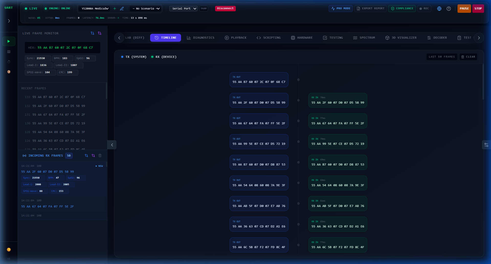

The Timeline Navigator provides a scrollable, zoomable macro view of the entire session:
- Color-coded event markers (faults, assertions, annotations).
- Waveform thumbnail "minimap" for quick navigation.
- Drag the view window to scrub through the session.

---

<a name="reporting"></a>
## 16. Validation & Reporting

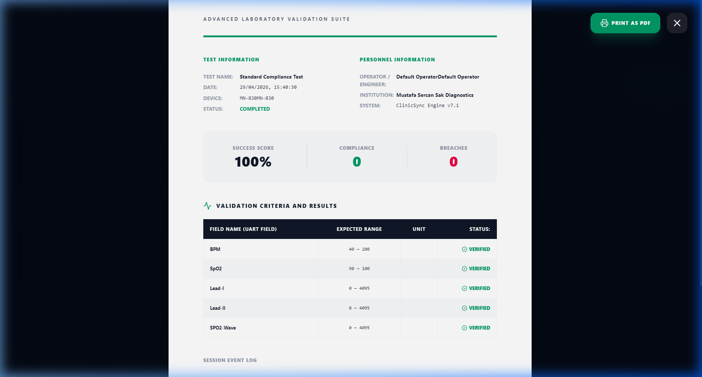

### 16.1 Validation Report (PDF Export)

The Validation Report is a production-ready PDF document suitable for **regulatory submission** (IEC 60601-1, ISO 13485 contexts). It includes:

| Section | Content |
|---|---|
| **Executive Summary** | Health Score, test duration, pass/fail verdict |
| **Signal Quality Analysis** | BER, SNR, error rate trend charts |
| **Field Validation Matrix** | Every field, its range rule, measured min/max, and pass/fail |
| **Fault Injection Summary** | All injected faults and whether they were detected |
| **Assertion Log** | Each assert event with timestamp and result |
| **Waveform Screenshots** | Auto-captured at key scenario timestamps |
| **Raw Data Statistics** | Packet count, frame length distribution, timing jitter histogram |

### 16.2 Health Score Calculation

```
Health Score = 100
  - (Error Rate × 30)      # Framing/parity/CRC errors
  - (BER × 20)             # Bit errors vs expected
  - (SNR Penalty × 20)     # If SNR < 30 dB
  - (Jitter Penalty × 15)  # If jitter > 5% of bit period
  - (Assert Failures × 15) # Failed scenario assertions
```

A score of **≥ 90** is required for regulatory-grade documentation.

### 16.3 Diagnostics Panel

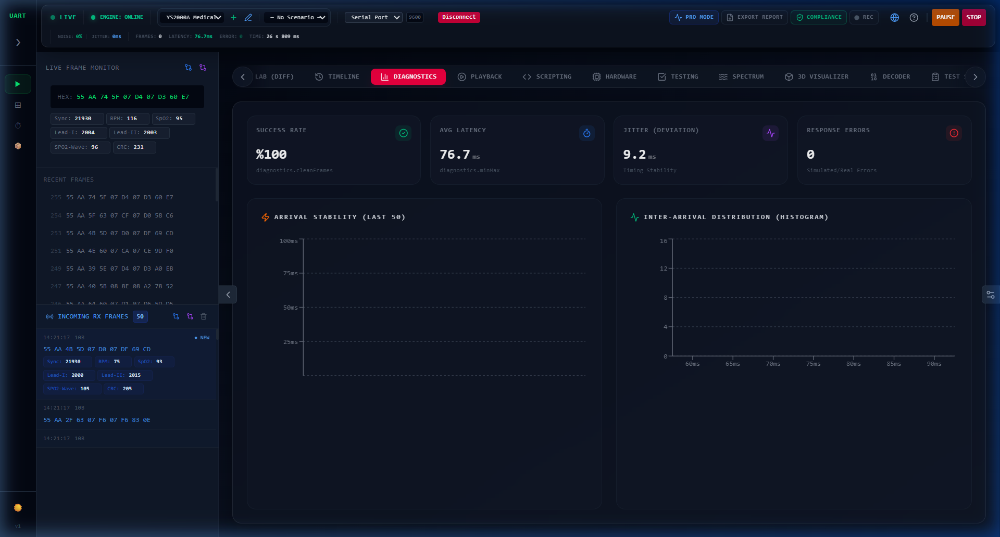

The live Diagnostics Panel shows:
- **Error Type Breakdown**: Pie chart of framing vs. parity vs. CRC errors.
- **Error Rate Over Time**: Rolling 5-second trend line.
- **Byte Distribution**: Histogram of all received byte values — useful for detecting stuck sensors (all values cluster at one point).
- **Inter-Packet Timing**: Histogram of time between consecutive frames — jitter visualization.

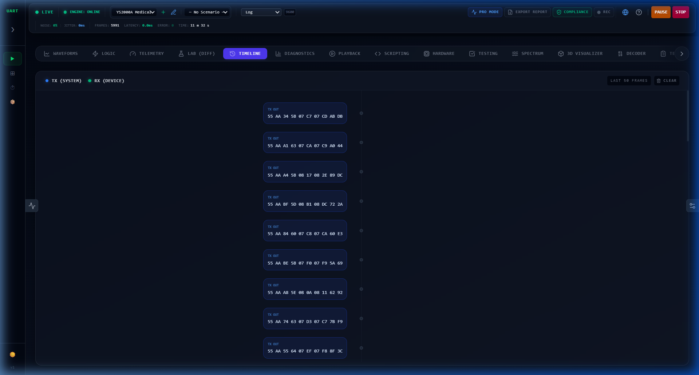

---

<a name="shortcuts"></a>
## 17. Keyboard Shortcuts

> **Tip**: Press `?` anywhere on the Dashboard to open the in-app shortcut cheatsheet.

### Simulation
| Shortcut | Action |
|---|---|
| `Space` | Play / Pause simulation |
| `Esc` | Stop simulation & deselect frame |
| `?` | Toggle keyboard shortcuts overlay |
| `Ctrl + K` | Open Command Palette |

### Profile Editor
| Shortcut | Action |
|---|---|
| `Ctrl + Z` | Undo last change |
| `Ctrl + Y` | Redo |
| `Ctrl + S` | Save active profile |
| `Enter` (tag input) | Add tag to profile |

### Frame Monitor
| Shortcut | Action |
|---|---|
| Click ⏺ | Start recording frames to CSV |
| Click ⏹ | Stop recording & download CSV |
| Click row | Select frame for inspection |

### Analysis
| Shortcut | Action |
|---|---|
| GitCompare (A) | Set Slot A reference frame |
| GitCompare (B) | Set Slot B test frame |
| `⇆` (toolbar) | Open Profile Compare modal |

### Logic Analyzer
| Shortcut | Action |
|---|---|
| `+` / `-` | Zoom in / out |
| `Home` | Reset zoom |
| `D` | Toggle decoder overlay |
| `M` | Place measurement marker |

### Playback
| Shortcut | Action |
|---|---|
| `Space` | Play / Pause |
| `←` / `→` | Step one frame back/forward |
| `Shift + ←` / `→` | Jump 10 seconds |
| `[` / `]` | Decrease / Increase speed |

---

<a name="troubleshooting"></a>
## 18. Troubleshooting & Optimization

### Common Issues

#### Framing Errors (0xFE) — High Rate
**Symptom**: Error counter climbs rapidly, raw data shows `0xFE` framing error bytes.
**Causes & Fixes**:
1. **Baud rate mismatch**: Verify transmitter and receiver baud rates match. Even a 0.5% difference can accumulate errors over long frames.
2. **Wrong stop bit count**: If the sensor uses 2 stop bits but the profile says 1, every frame has a framing error.
3. **Line noise**: Enable the Signal Integrity noise filter in the lab settings.

#### Sync Loss — Packet Decoder Loses Sync
**Symptom**: Decoded fields show garbage values, "SYNC LOST" badge appears.
**Causes & Fixes**:
1. **Wrong sync byte**: Check the `syncByte` in your Profile Editor matches your device's actual sync byte.
2. **Variable-length frames**: If your sensor uses variable-length frames, switch the profile's `frameMode` from `fixed` to `variable` with a length field offset.
3. **Corrupted first byte**: Use the "Re-sync" button — it fast-forwards to the next occurrence of the sync byte.

#### High CPU / Sluggish UI
**Causes & Fixes**:
1. **FFT size too large**: Reduce FFT size from 4096 to 1024.
2. **High baud rate with 75% overlap**: Overlap averaging is CPU-intensive. Reduce to 0% or 25%.
3. **Too many decoded fields**: Profiles with >30 fields may cause layout thrash. Collapse unused field groups.
4. **WebGL disabled**: Ensure hardware acceleration is enabled in your browser settings — the 3D Visualizer falls back to CPU rendering without it.

#### Session File Corrupted
**Symptom**: "Invalid session file" error on load.
**Fix**: Session files use a magic header `UART_PRO_1.4`. If the file is truncated (e.g., disk full during save), it cannot be recovered. Always verify the file size after saving.

### Performance Tips
- **High Baud Rates (>460800)**: Disable the 3D Visualizer and Spectrum Analyzer to free CPU for the simulation engine.
- **Long Sessions (>1 hour)**: Enable **Circular Buffer Mode** — older data is automatically purged. Without it, memory usage grows linearly.
- **Multiple Devices**: Keep all 8 virtual devices at the same baud rate — the engine uses a single time-base for all.

---

<a name="glossary"></a>
## 19. Glossary

| Term | Definition |
|---|---|
| **UART** | Universal Asynchronous Receiver/Transmitter — a hardware serial communication protocol |
| **Baud Rate** | Symbols per second. For UART, 1 baud = 1 bit/s |
| **Framing Error** | Occurs when the stop bit is detected as a logic 0 — indicates baud rate mismatch |
| **Parity Error** | The received parity bit does not match the computed parity of the data bits |
| **CRC** | Cyclic Redundancy Check — a polynomial-based error detection checksum |
| **BER** | Bit Error Rate — probability that any given bit is received incorrectly |
| **SNR** | Signal-to-Noise Ratio — ratio of signal power to noise power, in dB |
| **FFT** | Fast Fourier Transform — converts time-domain data to frequency domain |
| **Jitter** | Variation in the timing of signal transitions relative to their ideal positions |
| **Eye Diagram** | Superimposed view of many bit periods — the "eye opening" indicates timing margin |
| **Health Score** | UART Pro Lab's composite 0–100 score for signal quality and compliance |
| **Sync Byte** | A fixed byte (e.g., `0xAA`) that marks the start of every packet |
| **Digital Twin** | A software model of a hardware device that responds to commands in real time |
| **Bento-Grid** | The dashboard layout system — information-dense, modular panel arrangement |
| **Cubic Spline** | Mathematical interpolation technique for smooth waveform rendering |
| **Web Worker** | A browser background thread — used here to isolate simulation from UI |

---

## 20. CAN Bus Simulator

The CAN Bus module is a standalone, browser-native simulation environment for **ISO 11898-1 CAN 2.0A** networks. It runs on a dedicated **Web Worker** thread, completely isolated from the UART engine, and supports up to 127 nodes at baud rates of 125 / 250 / 500 / 1000 kbps.

Navigate to **CAN → Dashboard** from the sidebar.

---

### 20.1 Architecture Overview

| Layer | Component | Description |
|-------|-----------|-------------|
| Worker thread | `can.worker.ts` | Runs the simulation engine at 20 Hz, isolated from UI |
| Engine | `CANSimulationEngine` | Arbitration, fault injection, vitals, UDS protocol |
| Error state machine | `CANErrorStateMachine` | ISO 11898-1 TEC/REC counters, Error-Active/Passive/Bus-Off |
| Medical vitals | `CANMedicalVitals` | Per-profile vital sign evolution with Gaussian drift |
| Frame codec | `CANFrameParser` | 15-bit CRC, SLCAN encode/decode |
| Store | `CANContext` + `canReducer` | React context, Web Serial API, profile persistence |

---

### 20.2 Dashboard Layout

The dashboard is divided into three panels:

**Left panel — Node List**
- Lists all active CAN nodes with color-coded profile badges
- Add (`+`) or remove nodes; collapse with the `❮` toggle
- Each node card shows its ID, profile type, and live vital summary

**Center panel — Tabbed Workspace**

| # | Tab | Description |
|---|-----|-------------|
| 1 | Bus Monitor | Live frame stream with injection bar |
| 2 | Nodes | Full node grid with toggle/edit/remove |
| 3 | Arbitration | Collision event log (winner / loser pairs) |
| 4 | Log | Searchable, filterable event log with TXT export |
| 5 | Fault Injection | Clinical and network fault injection UI |
| 6 | Automation | Step-based timed fault sequences |
| 7 | Compliance | IEC 60601-1 / ISO 11898-1 / CiA 301 live metrics |

**Right panel — Inspector / Vitals**
- Toggle with the `⚙` button on the far right
- **Frame Inspector**: bit-level breakdown of the selected frame (Arbitration ID, DLC, data bytes, CRC, EOF)
- **Vitals Panel**: real-time vital sign sparklines for the selected node

---

### 20.3 Adding and Configuring Nodes

1. Click **+ Add Node** in the left panel header (or press **N**)
2. Set the **Node ID** (1–127; auto-increments to next free ID)
3. Enter a **name** (e.g. "Bed-3 Vital Monitor")
4. Select a **Medical Profile** — determines which vital signs are simulated and how they are encoded in the CAN data bytes
5. Adjust the **Arbitration ID** (default: `0x180 + nodeId`, standard CANopen TPDO1)
6. Set the **Send Interval** (10–2000 ms, i.e. 0.5–100 Hz)

**Available profiles:**

| Profile | Description |
|---------|-------------|
| Vital Monitor | HR, SpO₂, BP, Temp, RR |
| IV Pump | Flow rate, volume infused, pressure |
| Ventilator | Tidal vol, PEEP, FiO₂, peak pressure |
| ECG Monitor | HR, SpO₂, BP |
| Defibrillator | HR, standby state |
| Infusion Pump | Flow rate, volume, pressure |
| Pulse Oximeter | HR, SpO₂ |
| Custom | User-defined payload |

---

### 20.4 Running the Simulation

| Control | Action |
|---------|--------|
| ▶ Start | Begins simulation (requires at least one active node) |
| ⏸ Pause | Freezes frame generation; state is preserved |
| ▶ Resume | Continues from paused state |
| ■ Stop | Stops and resets to idle |

The top **Stat Bar** shows: total frames, error count, live FPS, bus load gauge, baud rate selector, and profile quick-load.

---

### 20.5 Bus Monitor & Frame Injection

The Bus Monitor streams all CAN frames in real time. Click any row to select it — the right-panel **Frame Inspector** will decode it.

**Manual Frame Injection** (top bar of Bus Monitor):
1. Enter the **Arbitration ID** in hex (e.g. `0x200`)
2. Enter **data bytes** as space-separated hex (e.g. `01 FF A0 00`, max 8 bytes)
3. Click **Send** or press **Enter**

Injected frames appear highlighted in cyan with the tag `INJECTED`. The bus must be running to inject.

---

### 20.6 Fault Injection

Switch to the **Fault Injection** tab. Select a node, then click a fault type:

**Clinical faults** (alter vital sign evolution):

| Fault | Effect |
|-------|--------|
| Cardiac Arrest | HR drops to ~6 bpm |
| Bradycardia | HR drifts to ~40 bpm |
| Tachycardia | HR climbs to ~160 bpm |
| Hypoxia | SpO₂ falls to ~85% |
| Hypotension | BP drops to ~60 mmHg |
| Hypertension | BP rises to ~190 mmHg |
| Fever | Temp rises to ~39.5°C |
| Hypothermia | Temp falls to ~35°C |

**Network faults:**

| Fault | Effect |
|-------|--------|
| Bus-Off | Node stops transmitting (TEC > 255) |
| Freeze | Node freezes last values, stops updating |
| Noise Burst | ~40% error rate for ~3 seconds |

Click **Recover Node** to restore normal operation.

---

### 20.7 Compliance Panel

The Compliance tab provides live ISO/IEC metrics:

| Metric | Threshold | Standard |
|--------|-----------|----------|
| Bus load | ≤ 30% | IEC 60601-1 §14 |
| Error rate | ≤ 1% | ISO 11898-1 §6.12 |
| Node availability | ≥ 99.9% | IEC 60601-1 §14 |
| Active alarms | 0 | Clinical requirement |

All four passing = **COMPLIANT** badge. Any failure = **NON-COMPLIANT** with the failing metric highlighted in red.

---

### 20.8 CAN Profiles

Save the current bus configuration (nodes + baud rate) as a reusable profile:

1. Navigate to **CAN → Profiles** (sidebar, or `navigate('/can-profiles')`)
2. Click **Save Current Bus** to snapshot the running configuration
3. Name and describe the profile
4. **Load to Bus** to restore any saved profile onto the dashboard

Four built-in profiles ship with the app: **ICU**, **ER**, **OR**, and **Ward** — each with a realistic set of pre-configured nodes.

---

### 20.9 Smart Listen

**Smart Listen** is a passive CAN discovery mode for unknown hardware configurations. Open the CAN Dashboard and click **Smart Listen** in the lower-right corner.

The scanner observes already captured traffic only. It does not inject frames, reset nodes, acknowledge traffic, or alter the running bus.

| Detection | Behavior |
|-----------|----------|
| Baud rate | Locks to common CAN speeds: 125k, 250k, 500k, or 1M bps |
| Margin | Requires the detected speed to be within 5% of a known rate |
| Protocol | Distinguishes Standard 11-bit CAN from Extended 29-bit CAN |
| Confidence | Enables **Sync and Connect** only after enough frames are observed |

When locked, click **Sync and Connect** to apply the detected baud rate and return to the Bus Monitor.

---

### 20.10 Keyboard Shortcuts

Press **?** anywhere on the CAN Dashboard to open the shortcuts cheatsheet.

| Key | Action |
|-----|--------|
| `Space` | Start / Pause / Resume |
| `Esc` | Stop bus |
| `1` – `8` | Switch to tab |
| `N` | Add new node |
| `C` | Clear bus frames |
| `Enter` | Send injected frame (when injection bar focused) |
| `?` | Toggle shortcuts modal |

---

### 20.11 UDS Diagnostic Terminal (ISO 14229 / ISO-TP)

The **Diagnostic Terminal** tab exposes a full UDS (Unified Diagnostic Services) stack over the ISO-TP (ISO 15765-2) transport layer. It lets you send standard diagnostic requests, inspect multi-frame ISO-TP traffic, and configure a simulated ECU that responds automatically.

#### Opening the Terminal

Select the **Diagnostics** tab (tab 6) on the CAN Dashboard. The panel is split into a configuration sidebar on the left and a live ISO-TP frame log on the right.

#### Configuring CAN IDs

| Field | Default | Notes |
|-------|---------|-------|
| Request ID | `0x7E0` | CAN ID used by the tester (this application) |
| Response ID | `0x7E8` | CAN ID used by the simulated ECU |

If the Request ID is in the standard range `0x7E0`–`0x7E7`, the Response ID is derived automatically (`requestId + 8`) when you leave the field.

#### Sending Requests

Choose a preset and click **Send UDS Request** (bus must be running):

| Preset | SID | Payload |
|--------|-----|---------|
| `0x10` Session Control | `0x10` | Configurable session type (Default / Programming / Extended) |
| `0x22` Read DID | `0x22` | 16-bit Data Identifier (hex, e.g. `F190` for VIN) |
| `0x19` Read DTC | `0x19` | Sub-function `0x02`, configurable status mask |
| Raw | — | Any hex bytes separated by spaces |

Multi-frame payloads are automatically segmented using ISO-TP (First Frame + Consecutive Frames). A Flow Control frame is injected after the First Frame.

#### Symphony — Automated ECU Responses

Toggle **Symphony On** to enable the simulated ECU. When active, the engine:

1. Receives and reassembles multi-frame requests.
2. Processes the UDS Service Identifier (SID).
3. Transmits an ISO-TP response automatically.

Supported SIDs and their responses:

| SID | Service | Positive Response |
|-----|---------|------------------|
| `0x10` | Diagnostic Session Control | `0x50` + session params |
| `0x22` | Read Data By Identifier | `0x62` + DID + value bytes |
| `0x19` | Read DTC Information (SF `0x02`) | `0x59` + DTC records |
| Other | — | `0x7F` NRC `0x11` (serviceNotSupported) |

#### DID Response Table

Configure what value is returned for each DID:

| Encoding | Behaviour |
|----------|-----------|
| **ASCII** | Value string is transmitted as raw ASCII bytes |
| **Hex** | Hex string (e.g. `DEADBEEF`) is split into bytes |
| **Vitals** | Live vital value (e.g. `heartRate`, `spO2`) is read from the target node at response time, scaled ×10, and returned as a 2-byte big-endian integer |

Use **Target Node** to pin vitals responses to a specific simulation node. Leave it as **Auto from request ID** to let the engine infer the node from the tester request ID offset.

#### ISO-TP Frame Log

The right panel shows all frames on the diagnostic CAN IDs:

| Column | Content |
|--------|---------|
| Time | ISO timestamp (ms precision) |
| ID | CAN arbitration ID |
| PCI | Frame type: **SF** (Single Frame), **FF** (First Frame), **CF** (Consecutive Frame), **FC** (Flow Control) |
| Data | Raw hex payload (8 bytes, zero-padded) |

Tester frames have a cyan background; ECU frames have an emerald background.

---

## Conclusion

**UART Pro Lab v1.6.0** is not a simulator — it is a complete **medical-grade, regulatory-ready signal engineering environment** that runs entirely in your browser.

Every feature was designed around a real engineering problem: framing errors that escape unit tests, jitter that only appears under thermal stress, waveform anomalies invisible to the naked eye. This tool surfaces all of them — before they reach silicon.

---

*Mustafa Sercan Sak — Chief Architect*  
*© 2026 Mustafa Sercan Sak Diagnostics · v1.6.0-STABLE*
