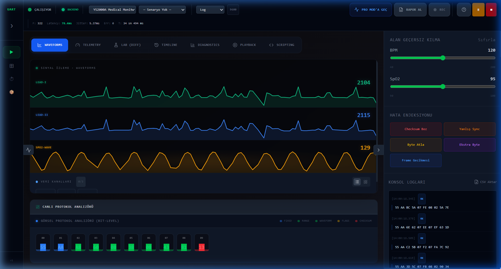

# 🩺 Professional UART Sensor Simulator & Telemetry Dashboard v1.6.0

A high-performance, real-time UART telemetry platform designed for **embedded engineers** and **medical device developers**. Simulate complex sensor data (ECG, SpO₂, RESP, etc.) and stream it directly to your hardware via the **Web Serial API**.

---

## 🚀 Key Features (v1.6.0)

### 🆕 v1.6.0 — UX & Developer Tools Update
- **Profile Compare Modal**: Compare any two profiles side-by-side directly from the Profile Editor toolbar (⇆ button).
- **Frame Timing / BER Panel**: Instantly see bits/frame, frame duration (µs), max FPS, and line utilization for the active profile. Highlights over-utilization in red.
- **Profile Tags**: Organize profiles with custom tags. Filter the profile list by tag with one click.
- **Frame Recorder (CSV)**: Record live TX frames and export them as CSV with a single button in the Frame Monitor.
- **Frame Flash Animation**: Each new incoming frame briefly flashes green in the Frame Monitor for instant visual feedback.
- **Keyboard Shortcuts Modal**: Press `?` anywhere on the Dashboard to open a shortcut cheatsheet covering all key bindings.
- **Community Template Favorites**: Star/unstar any community template. Favorites are persisted locally and sorted to the top.
- **Last Used Field Type Memory**: The Profile Editor remembers the last field type you selected and uses it as the default for new fields.
- **CAN Smart Listen**: Passive CAN discovery mode detects Standard/Extended CAN traffic and locks common bus speeds before enabling Sync and Connect.

### 🎨 Custom Waveform Designer
Go beyond static signals. **Draw** your own waveforms by hand, generate them with **Math Formulas**, or use our **Clinical Preset Library** (ECG, PPG, Resp). Inject these custom signals directly into your UART stream in real-time.

### 📐 High-Density Bento Dashboard
A professional-grade interface designed for maximum information density. Monitor telemetry, high-resolution waveforms, and logic analysis on a single compact screen without scrolling.

### 🤖 Sequence Runner & Test Series
Build **send / wait / expect** automation sequences and run them against any UART device. In **Test Series** mode, select multiple sequences across groups, execute them back-to-back, and export a professional **PDF report** with per-step pass/fail results — in both Turkish and English.

### 🧪 Error Injection & Lab Modules
- **Jitter & Noise**: Simulate real-world signal degradation.
- **Protocol Diff**: Bit-level comparison of UART packets for reverse engineering.
- **Logic Analyzer**: Bit-by-bit visual protocol decoding.

### 📜 Validation & Reporting
Generate print-ready **Medical Device Compliance Reports** in PDF format, documenting every session, violation, and compliance score for regulatory proof.

### 🌍 Full i18n Support
Complete **English** and **Turkish** localization with a built-in compliance test suite.

---

## 🏃 Quick Start
1. **Install**: `npm install`
2. **Server**: `npm run server`
3. **Frontend**: `npm run dev`
4. **Action**: Open [http://localhost:5173](http://localhost:5173), select a profile, and hit **"Start Simulation"**.

---

## 📖 Documentation
- [Ana Mühendislik Kılavuzu (Turkish)](GUIDE_TR.md) - Kapsamlı teknik rehber.
- [Master Engineering Manual (English)](GUIDE_EN.md) - Comprehensive technical reference.
- [Changelog](CHANGELOG.md) - Version history and milestones.

---

Developed by **Mustafa Sercan Sak**  
© 2026 Mustafa Sercan Sak Diagnostics
